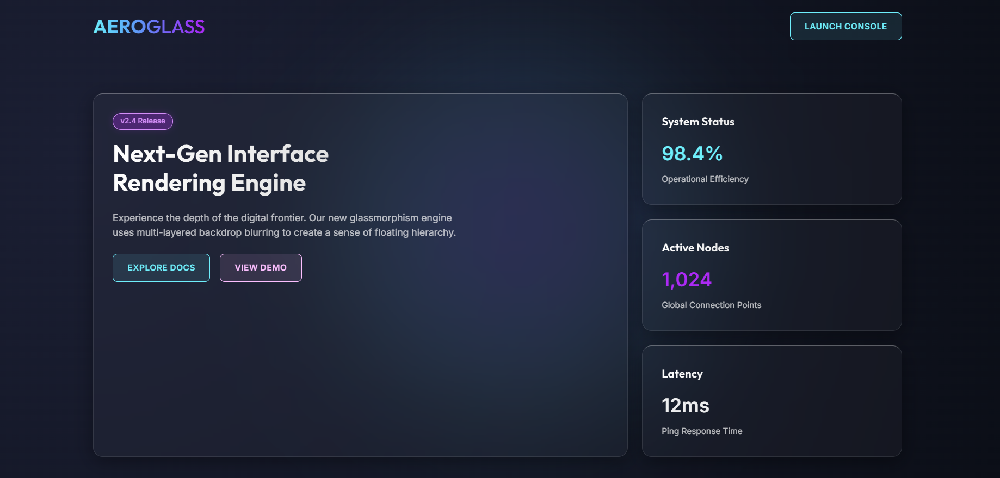
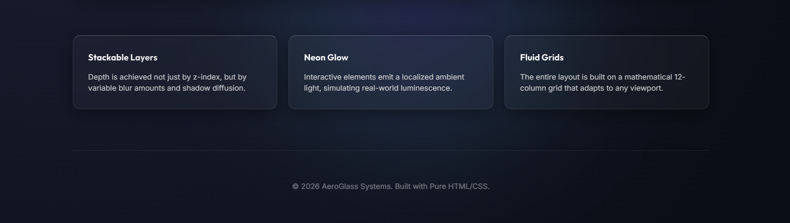

# Lab 01: AeroGlass - Glassmorphism UI Engine

## 1. Project Overview
The objective of Lab 1 was to design and implement a visually striking, user-friendly web interface using **Pure HTML5 and CSS3**, strictly without the use of CSS frameworks (such as Bootstrap or Tailwind).

The project, titled **"AeroGlass,"** focuses on the **Glassmorphism** design trend, utilizing transparency, background blurring, and floating elements to establish a modern "Deep Space" aesthetic.

## 2. Design Concept & Theme
The interface follows a "Floating Depth" concept with the following core visual characteristics:

* **Theme:** Dark Mode / Deep Space.
* **Color Palette:**
    * **Background:** Deep Space Blue (`#0f172a` to `#0a0e17` gradient).
    * **Glass Surface:** Semi-transparent white with high opacity (`rgba(255, 255, 255, 0.05)`).
    * **Accents:** Neon Cyan and Purple gradients to guide user attention.
* **Visual Metaphor:** The UI mimics frosted glass floating in zero gravity, where depth is communicated through distinct Z-axis layering and shadow diffusion.

## 3. Key Features & Content
The interface is structured as a modern System Dashboard or Landing Page for a rendering engine.

### A. The Hero Section (Top Left)
* **Purpose:** Introduces the product ("Next-Gen Interface Rendering Engine").
* **Content:** A strong headline followed by descriptive text explaining the multi-layered backdrop technology.
* **Interaction:** Two primary Call-to-Action (CTA) buttons:
    * "Explore Docs" (Ghost button style).
    * "View Demo" (Solid gradient style).

### B. Dashboard Metrics (Right Column)
To simulate a functional data interface, the right side displays real-time system stats encapsulated in glass cards:
1.  **System Status:** Displays "98.4% Operational Efficiency."
2.  **Active Nodes:** Shows "1,024 Global Connection Points."
3.  **Latency:** Displays a low ping response time of "12ms."

### C. Feature Grid (Bottom Section)
Three cards highlighting the technical capabilities of the UI engine:
* **Stackable Layers:** Explains the use of Z-index and variable blur for depth.
* **Neon Glow:** Describes the localized ambient light effects on interactive elements.
* **Fluid Grids:** Highlights the mathematical 12-column grid system used for layout.

## 4. Technical Implementation
Adhering to the "Advanced Web Development" requirements, the codebase is modular and semantic:

* **Technology Stack:** Pure HTML5, CSS3 (No Frameworks).
* **Architecture:**
    * **Semantic HTML:** Usage of `<header>`, `<main>`, `<section>`, and `<article>` for better accessibility and SEO.
    * **CSS Variables:** Global tokens used for colors, spacing, and glass effects (e.g., `--glass-surface`, `--neon-primary`) to ensure consistency.
    * **Layout Engine:** A combination of **CSS Grid** for the main macro-layout and **Flexbox** for internal component alignment.
* **Advanced CSS Techniques:**
    * **Backdrop Filter:** `backdrop-filter: blur(16px)` is the core engine creating the frosted glass effect.
    * **Gradients:** Complex linear and radial gradients are used for borders and text highlights (Text Gradients).
    * **Micro-Interactions:** Hover states on buttons and cards utilize `transition` and `transform` to create a "lifting" effect, simulating tactile feedback.

---
**Screenshots:**

